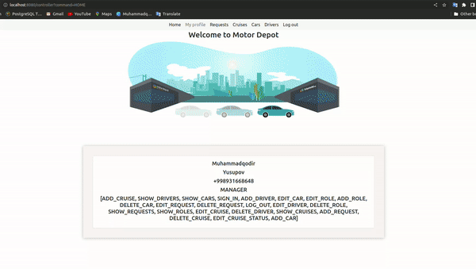

# motor-depot

  

<h1>The platform supports only English language.</h1>

# Description

Motor depot. The Dispatcher distributes Requests for Cruises between Drivers, each of whom has his own Car assigned to them.
A Car that is in good condition and whose characteristics correspond to the Application can be assigned to the Cruise.
The driver makes a note about the performance of the Race and the condition of the Car.

# Project stack

<h3> Java EE / PostgreSQL / HTML5 / CSS3 / Bootstrap 5 / JavaScript / Command design pattern </h3>

# Functional roles

The platform supports the following roles and their corresponded functionality.

|  Permission        | MANAGER | DISPATCHER  | DRIVER |
|      :-            |   :-:   |     :-:     |   :-:  |
|  SIGN_IN           |    +    |      +      |    +   |
|  LOG_OUT           |    +    |      +      |    +   |
|  ADD_REQUEST       |    +    |      +      |        |
|  EDIT_REQUEST      |    +    |      +      |        |
|  DELETE_REQUEST    |    +    |      +      |        |
|  SHOW_REQUESTS     |    +    |      +      |        |
|  ADD_CRUISE        |    +    |             |        |
|  EDIT_CRUISE       |    +    |             |        |
|  DELETE_CRUISE     |    +    |      +      |        |
|  SHOW_CRUISES      |    +    |             |    +   |
|  EDIT_CRUISE_STATUS|    +    |             |    +   |
|  ADD_DRIVER        |    +    |             |        |
|  DELETE_DRIVER     |    +    |             |        |
|  EDIT_DRIVER       |    +    |             |        |
|  SHOW_DRIVERS      |    +    |             |        |
|  ADD_CAR           |    +    |             |        |
|  DELETE_CAR        |    +    |             |        |
|  EDIT_CAR          |    +    |             |        |
|  SHOW_CARS         |    +    |             |        |
|  ADD_ROLE          |    +    |             |        |
|  EDIT_ROLE         |    +    |             |        |
|  DELETE_ROLE       |    +    |             |        |
|  SHOW_ROLES        |    +    |             |        |

# Database schema

PostgreSQL database is used to store data.

  <kbd> </kbd> 

Database schema

## Installation

1. Clone the project.
2. Create a new PostgreSQL database. 
3. Create tables using init-ddl.sql and create triggers using init-triggers.sql from the resources/data folder.
4. Change the application.properties file, located in the resources' folder, based on your database configurations.
5. Build the project using maven.
6. Add new Tomcat 8.5.81 configuration to the project. You can download from https://archive.apache.org/dist/tomcat/tomcat-8/v8.5.81/bin/
7. Run Tomcat and open http://localhost:8080/ on the browser.
8. Log in as manager. Admin default account is phoneNumber +998931668648, password - 123.

## Usage

  <kbd> </kbd> 

Sign in

 

  <kbd> </kbd> 

Adding Request

 
